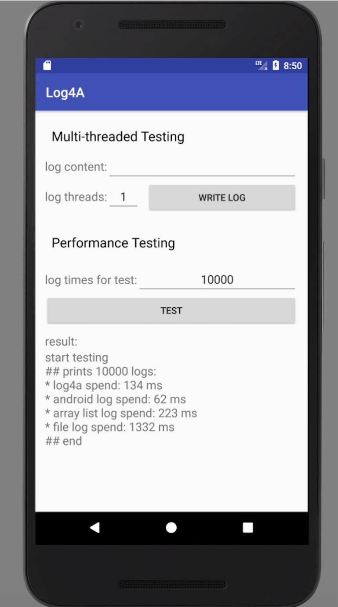
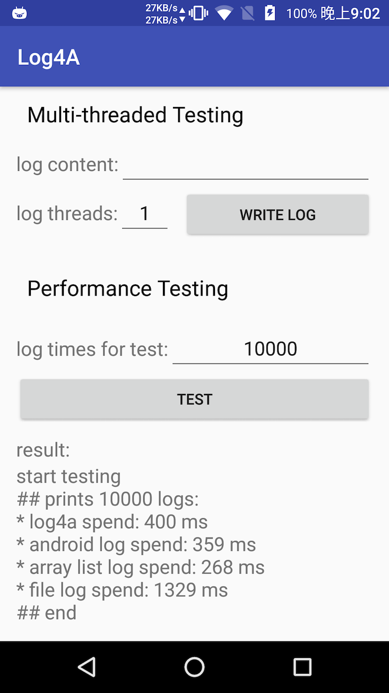

# Log4a

    Log4a 是一个基于 mmap, 高性能、高可用的 Android 日志收集框架


## WHY:

对于移动开发者来说，针对一些用户反馈难以复现的线上问题，分析日志有时候是解决问题的必要手段。
但是日志的收集一直有个痛点，就是性能与日志完整性无法兼得。
要实现高性能的日志收集，势必要使用大量内存，先将日志写入内存中，然后在合适的时机将内存里的日志写入到文件系统中（flush），
如果在 flush 之前用户强杀了进程，那么内存里的内容会因此而丢失。
日志实时写入文件可以保证日志的完整性，但是写文件是 IO 操作，涉及到用户态与内核态的切换，相比较直接写内存会更耗时，UI 线程中频繁的写文件会造成卡顿，影响用户体验。

Log4a 使用 mmap 文件映射内存作为缓存，可以在不牺牲性能的前提下最大化的保证日志的完整性。
日志首先会写入到 mmap 文件映射内存中，基于 mmap 的特性，即使用户强杀了进程，日志文件也不会丢失，并且会在下次初始化 Log4a 的时候回写到日志文件中。

## HOW:

使用方法与 android.util.Log 一致，不同的是你需要进行简单的配置，当然也预留了丰富的接口供拓展使用，更高级的配置可以查看[Sample](https://github.com/pqpo/Log4a/blob/7d92dc4ad244c8af80d0c5ce6e02d7bff53277b8/app/src/main/java/me/pqpo/log4a/LogInit.java#L23);

1. 在 build.gradle 文件中添加依赖：
```groovy
allprojects {
	repositories {
		maven { url 'https://jitpack.io' }
	}
}
	
dependencies {
    compile 'com.github.pqpo:Log4a:v1.0.0'
}
```

2. 设置并初始化Log4a:
```java
AndroidAppender.Builder androidBuild = new AndroidAppender.Builder();

File log = FileUtils.getLogDir(context);
String log_path = log.getAbsolutePath() + File.separator + "log.txt";
FileAppender.Builder fileBuild = new FileAppender.Builder(context)
                          .setLogFilePath(log_path);
                          
Logger logger = new Logger.Builder()
          .enableAndroidAppender(androidBuild)
          .enableFileAppender(fileBuild)
          .create();
          
Log4a.setLogger(logger);
```

3. 使用方式与 android.util.Log 完全一致：
```java
Log4a.i(TAG, "Hello，Log4a!");
```

4. 在合适的时间刷新缓存或者释放内存  
```java
//在应用退出的时候刷新缓存
Log4a.flush();
//如果想要释放内存可以调用下面的方法，内部会调用刷新，下次使用需要重新初始化
Log4a.release();
```

## 性能测试

性能测试的代码位于 Sample 中，分别测试了 Log4a, android.util.Log, 直接写内存（将日志内容保存到 ArrayList 中），实时写文件
你也可以自行下载 [Sample APK](art/log4a_sample_v1.0.0.apk)，在你自己的设备上进行测试。

下面是在分别是模拟器和 Moto X 2014 老爷机中写1w条日志的测试情况（其中 android.util.Log 打印的日志均不完整，模拟器中打印出4472条，Moto 中打印出 9937 条）：  
 

对于性能方面基本上可以得出：  
直接写内存当然是最快的，android.util.Log 次之，然后是 Log4a, 最慢的是实时写文件。
日志完整性：
Log4a 与 实时写文件均保存了完整的日志到文件中，android.util.Log 在 Logcat 中且不能保证完整性，也无法持久化到文件中。

## License

    Copyright 2017 pqpo
    
    Licensed under the Apache License, Version 2.0 (the "License");
    you may not use this file except in compliance with the License.
    You may obtain a copy of the License at
    
       http://www.apache.org/licenses/LICENSE-2.0
    
    Unless required by applicable law or agreed to in writing, software
    distributed under the License is distributed on an "AS IS" BASIS,
    WITHOUT WARRANTIES OR CONDITIONS OF ANY KIND, either express or implied.
    See the License for the specific language governing permissions and
    limitations under the License.

