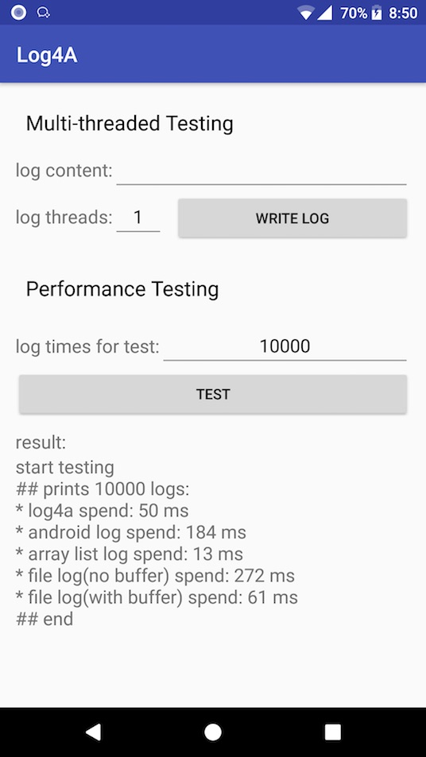
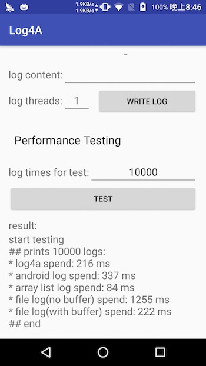

# Log4a

([English](README.md) | 中文)

    Log4a 是一个基于 mmap, 高性能、高可用的 Android 日志收集框架

## WHY Log4a:

**如果觉得还不错，欢迎 start，fork。**

Log4a 使用 mmap 文件映射内存作为缓存，可以在不牺牲性能的前提下最大化的保证日志的完整性。
日志首先会写入到 mmap 文件映射内存中，基于 mmap 的特性，即使用户强杀了进程，日志文件也不会丢失，并且会在下次初始化 Log4a 的时候回写到日志文件中。

对于移动开发者来说，针对一些用户反馈难以复现的线上问题，分析日志有时候是解决问题的必要手段。
但是日志的收集一直有个痛点，就是性能与日志完整性无法兼得。
要实现高性能的日志收集，势必要使用大量内存，先将日志写入内存中，然后在合适的时机将内存里的日志写入到文件系统中（flush），
如果在 flush 之前用户强杀了进程，那么内存里的内容会因此而丢失。
日志实时写入文件可以保证日志的完整性，但是写文件是 IO 操作，涉及到用户态与内核态的切换，相比较直接写内存会更耗时，UI 线程中频繁的写文件会造成卡顿，影响用户体验。

## HOW:

使用方法与 android.util.Log 一致，不同的是你需要进行简单的配置，当然也预留了丰富的接口供拓展使用，更高级的配置可以查看[Sample](https://github.com/pqpo/Log4a/blob/7d92dc4ad244c8af80d0c5ce6e02d7bff53277b8/app/src/main/java/me/pqpo/log4a/LogInit.java#L23);

1. 在 build.gradle 文件中添加依赖：
```groovy
allprojects {
	repositories {
		maven { url 'https://jitpack.io' }
	}
}
	
dependencies {
    compile 'com.github.pqpo:Log4a:{last-version}'
}
```

2. 设置并初始化Log4a:  
https://github.com/pqpo/Log4a/blob/master/app/src/main/java/me/pqpo/log4a/LogInit.java

3. 使用方式与 android.util.Log 完全一致：
```java
Log4a.i(TAG, "Hello，Log4a!");
```

4. 选择在合适的时候刷新缓存**或者**释放内存  
```java
//在应用退出的时候刷新缓存
Log4a.flush();
//如果想要释放内存可以调用下面的方法，内部会调用刷新，下次使用需要重新初始化
Log4a.release();
```

## 性能测试

性能测试的代码位于 Sample 中，分别测试了 Log4a, android.util.Log, 直接写内存（将日志内容保存到 ArrayList 中）, 实时写文件, 使用 Buffer 写文件
当然也可以自行下载 [Sample APK](art/log4a_sample_v1.0.0.apk)，在你的设备上进行测试。

下面分别是在 Google Pixel 和 Moto X 中写1w条日志的测试情况：  

|Google Pixel|Moto X|
|:---:|:---:|
|||

上图中 google pixel 的测试数据表格如下（按消耗时间排序）：

|设备|测试类型|消耗时间|日志是否完整|是否持久化|断电后能否保证日志完整|
|:---:|:---:|:---:|:---:|:---:|:---:|
|Google Pixel|Mem|13ms|Y|N|N|
|Google Pixel|Log4a|50ms|Y|Y|Y|
|Google Pixel|File with Buffer|61ms|Y|Y|N|
|Google Pixel|Android Log|184ms|N|N|N|
|Google Pixel|File no Buffer|272ms|Y|Y|Y|

可以看出 Log4a 的写日志性能仅次于直接写内存，与使用 BufferOutputStream 写文件基本保持一致，事实上为了保证多线程安全性， Log4a 在写 mmap 内存的时候都是加锁的，在没锁的情况下可以更靠近直接写内存的速度（有兴趣的可以自行测试）。  
BufferOutputStream 是将先数据缓存在内存中，之后再刷新进文件的，如果在刷新之前断电了或者强杀了进程，那么内存中的数据就会丢失无法恢复。Log4a 会在下次启动的时候恢复日志文件保证日志的完整性。

## 感谢

- [Tencent/mars](https://github.com/Tencent/mars)
- [XLog](https://github.com/elvishew/xLog)

---

## 关于我：

- 邮箱：    pqponet@gmail.com
- GitHub：  [pqpo](https://github.com/pqpo)
- 博客：    [pqpo's notes](https://pqpo.me)
- Twitter: [Pqponet](https://twitter.com/Pqponet)
- 微信公众号: pqpo_me(扫下方二维码) 


## License

    Copyright 2017 pqpo
    
    Licensed under the Apache License, Version 2.0 (the "License");
    you may not use this file except in compliance with the License.
    You may obtain a copy of the License at
    
       http://www.apache.org/licenses/LICENSE-2.0
    
    Unless required by applicable law or agreed to in writing, software
    distributed under the License is distributed on an "AS IS" BASIS,
    WITHOUT WARRANTIES OR CONDITIONS OF ANY KIND, either express or implied.
    See the License for the specific language governing permissions and
    limitations under the License.

